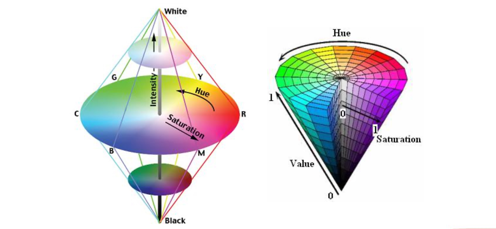

### 视觉系统都有哪些构成要素? 以机械臂视觉控制系统为例，说明视觉系统的构成要素。

**构成要素**

1. 照明设备：光源
2. 成像设备：相机
3. 处理设备：主机
4. 算法软件：视觉处理系统

**举例说明**

1. 机械臂视觉控制系统一般会在室内, 它的照明设备是室内光线, 如果光线不足, 我们会设置一个补光来让系统看得更清楚。
2. 机械臂的成像设备则是一种照相设备, 置于机械臂的上端, 方便采像。
3. 机械臂的处理设备是一个电脑主机, 置于下部位置。
4. 机械臂的主机内置算法软件, 也就是视觉处理系统, 根据成像分析处理完成指定的操作任务。

### 尝试从模仿人类视觉处理流程的角度，阐述本对课程内容组织的理解。进一步在网上搜索，找到自己认为学习过程中最值得参考的1-2本书(不要太厚)

**对计算机视觉内容结构组织的理解**

1. 当人类看到一个图像时会经过我们的视觉中枢系统进行复杂的处理：通过眼睛感受外接物体反射的光线，进一步通过视觉传导纤维到达脑后视觉处理中枢，视觉处理中枢又分为v1~v5等多个区域
2. 人类尝试使用让计算机来看见世界, 在了解人类自身的视觉系统后，人类想要通过计算机来模拟整个"看见"的过程，这是人类通过类比的逻辑进行的技术创新
3. 课程通过人类发展史、技术发展史、计算机视觉理论发展史逐步展开，一步一步的逐步揭示计算机视觉的本质，以及通过一个个的生动的例子，让我们在理解上更加容易
4. 同时计算机视觉在深度学习技术的进步得到了飞速的发展，两者相辅相成，相互促进，当然离不开图像处理和模式识别这些学科上
5. 在最底层则离不开我们的数学、物理和基础算法等内容。在这样的组织架构就像是金字塔一样，是一种从基础到高级的逐步过渡，理论和实践相互结合, 让我们在编码中体会其中的真谛。

**书籍**

1.《机器视觉》
2.《计算机视觉教程(第2版)》

### 什么是光通量和辐照度？说明几个常见光源的光通量，以及几个常见照明环境的辐照度。

**光通量**

人能够看到周围的世界有2个部分构成：外在光源、光源物体表面的情况，光通量是指人眼所能感觉到的辐射功率，它等于单位时间内某一波段的辐射能力和该波段的相对视见率的乘积，以符号Φ表示，单位是lm(流明)，1lm = 0.00146瓦

**常见照明环境的光通量**

<table width="700">
    <tr>
        <th>光源</th>
        <th>光通量</th>
        <th>说明</th>
    </tr>
    <tr>
        <td>太阳</td>
        <td>3.566 * 10^28 lm</td>
        <td>我们生存的能量来源</td>
    </tr>
    <tr>
        <td>烛光</td>
        <td>12.56lm (4π)</td>
        <td>光通量的定义</td>
    </tr>
    <tr>
        <td>白炽灯/卤钨灯</td>
        <td>12~24lm / W</td>
        <td>卤钨灯效率高于白炽灯</td>
    </tr>
    <tr>
        <td>荧光灯和气体放电灯</td>
        <td>50~120lm / W</td>
        <td>气体放电灯</td>
    </tr>
    <tr>
        <td>LED灯</td>
        <td>110lm / W</td>
        <td></td>
    </tr>
</table>

**辐照度**

辐照度：指投射到一个平面表面上的辐射通量密度(我们能够感受到的光的强弱)。指达到一表平面上，单位时间，单位面积上的辐射能，以符号E表示，通常单位是lux(勒克斯)，1lux = 1lm / m^2

**常见照明环境的辐照度**

<table width="700">
    <tr>
        <th>场景</th>
        <th>照度(lux)</th>
        <th>说明</th>
    </tr>
    <tr>
        <td>黑夜</td>
        <td>0.001 ~ 0。02</td>
        <td>月夜是0.02 ~ 0.3</td>
    </tr>
    <tr>
        <td>阴天室内</td>
        <td>5 ~ 50</td>
        <td>阴天室外</td>
    </tr>
    <tr>
        <td>晴天室内</td>
        <td>100 ~ 1000</td>
        <td>在做视觉系统时需要进行补光</td>
    </tr>
    <tr>
        <td>晴天阳光直射</td>
        <td>100000</td>
        <td>在做视觉系统时不需要补光</td>
    </tr>
    <tr>
        <td>适合阅读</td>
        <td>300 ~ 750</td>
        <td>阅读书刊时需50~60</td>
    </tr>
    <tr>
        <td>家用摄像机标准照度</td>
        <td>1400</td>
        <td>在做视觉系统时需要补光</td>
    </tr>
</table>

### 结合颜色空间示意图，简述HSI颜色空间中各通道的物理意义，并结合图像实例说明。

**HSI颜色模型**

1. 色调H是描述纯色的属性(如红色、黄色等)
2. 饱和度S表示的是一种纯色被白光稀释的程度的度量
3. 亮度I体现了无色的光强度概念，是一个主观的描述

空间示意图

    

1. 横切圆盘上只有色度和饱和度两个量，色度范围是(0~2π), 从红到紫;饱和度代表颜色距离圆心的长短(在高等数学上叫矢径),饱和度越大(越在圆的边缘)越鲜艳
2. 锥体的上下对应的是亮度, 底部是黑色, 上部是白色
3. 锥体内部任意取一点就是一个颜色块
4. HSI和HSV都是一种概念的两个模型抽象，可以理解为一个颜色模型

### 说明彩色图像传感器及γ校正的基本原理。

**彩色图像传感器的原理**

- 精确图像的彩色信息, 目前技术上还做不到, 换句话说实际制造和技术上存在困难, 只能通过变通的方式来实现
- 彩色传感器最底层采用的和CCD是一样,每个小格子只能敏感灰度信息, 在其上面覆盖一层非常薄的膜, 使用光刻了很多小格子, 每个小格子里涂上不同的颜色, 有颜色的小格子会把对应的光线吸收, 当光通过绿色格子的时候留下的光线只有绿色, 所以可以通过红色、绿色、蓝色三个非常微小的像素来模拟一个像素, 这是彩色传感器可以产生彩色图像的原因
- 最后在最上面还覆盖着一层薄膜, 用光刻的方法来刻出微小的透镜, 确保光线经过透镜汇聚到下面的光刻小格子上, 微透镜可以提升光的敏感和转化效率。
- 在不同颜色的光刻小格子中，其中绿色占据一半, 红蓝占据四分之一。 不均等分配的原因是在人的视觉系统中, 绿色占据视觉感受信息的大半, 绿色可以让人可以看得更清楚。
- 光刻小格子的格式我们可以称为贝尔格式，颜色之间有计算公式，这里不做展开

**γ矫正的基本原理**

- 人眼的视觉感应和照明值关系是非线性的(人眼对亮度的敏感度在不同的程度是不一样的, 在18%的地方人眼敏感度是50%, 当一个图像亮度是18%的时候,人的感受是50%的亮度)
- CCD的采集后的图像进行一次γ矫正后就和我们实际看到的就几乎一致了
- 正常图像在采集传输存储过程中,我们会进行两次γ矫正, 第一次矫正发生在传感器采集到图像, 然后把对应的图像保存的时候, 矫正值是1/2.2,保证图像在存储的时候基本按照线性方式去量化我们输入的亮度, 保证量化精度。
- 进一步我们从图像存储到最终显示设备上, 经历了第二次γ矫正, 这次校正值是2.2, 为了让图像更符合人类的视觉特征(和人类感受一致)
- 总结来说：图像传感器存储时经过γ矫正，以更好的进行量化，显示时转换为符合人的视觉特征
